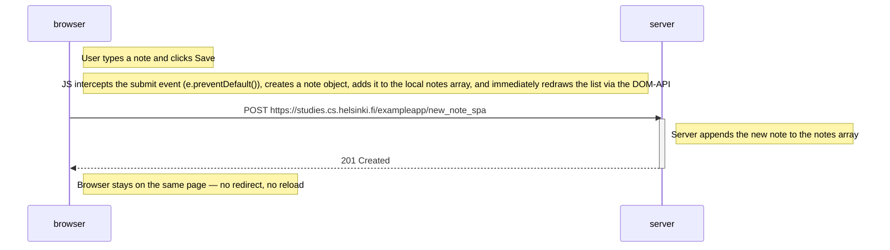

```mermaid
sequenceDiagram
    participant browser
    participant server

    Note right of browser: User types a note and clicks Save

    Note right of browser: JS intercepts the submit event (e.preventDefault()), creates a note object, adds it to the local notes array, and immediately redraws the list via the DOM-API

    browser->>server: POST https://studies.cs.helsinki.fi/exampleapp/new_note_spa
    activate server
    Note right of server: Server appends the new note to the notes array
    server-->>browser: 201 Created
    deactivate server

    Note right of browser: Browser stays on the same page — no redirect, no reload
```